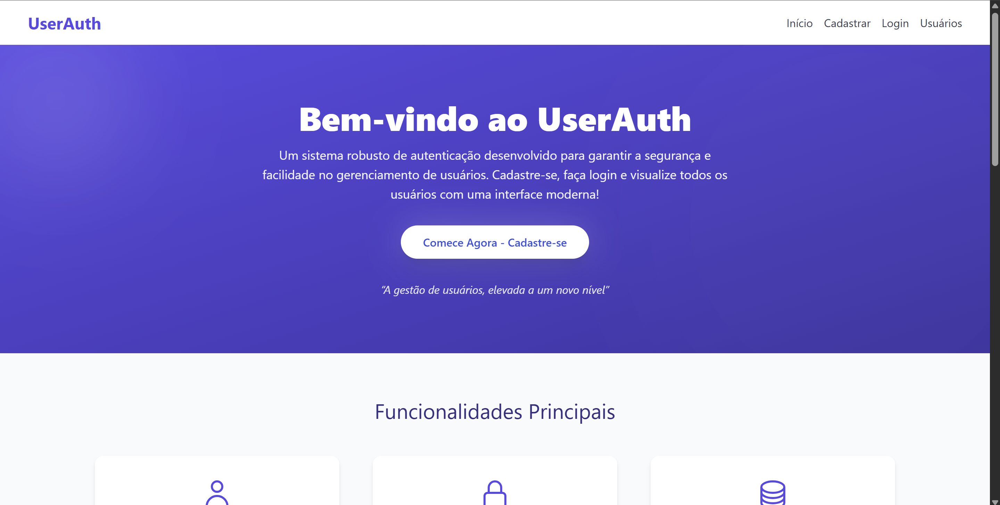

# UserAuth – Sistema de Autenticação com PHP + SQLite

Este é um sistema de autenticação de usuários simples, seguro e organizado, desenvolvido como parte do exercício da disciplina **Design Patterns & Clean Code**.


---

## Objetivo

Criar uma aplicação funcional de autenticação de usuários utilizando:
- PHP orientado a objetos
- SQLite como banco de dados local
- Boas práticas como **PSR-12**, **KISS** e **DRY**
- Hash seguro de senhas (`password_hash`)
- Validação de entrada (email, senha forte, duplicação)
- Interface amigável com feedback visual (flash messages)

---

## Funcionalidades Implementadas

| Funcionalidade       | Descrição |
|----------------------|-----------|
| Cadastro           | Validação de email, senha forte e e-mails duplicados |
| Login             | Verificação de credenciais com `password_verify` |
| Listagem          | Tabela com todos os usuários cadastrados |
| Reset de Senha    | Acesso via modal com regras de validação de senha |
| Logout            | Finaliza a sessão do usuário |
| Flash Messages    | Feedback visual com mensagens temporárias (sucesso/erro) |

---

## Casos de Uso Testados

| Cenário | Entrada | Resultado |
|--------|---------|-----------|
| **Cadastro válido** | Email: maria@email.com, Senha: Senha123 | Usuário cadastrado |
| **Email inválido** | Email: joao@@email | Erro de validação |
| **Senha fraca** | Senha: abc | Senha rejeitada |
| **Login com erro** | Senha incorreta | "Credenciais inválidas" |
| **Reset de senha** | Nova senha válida via modal | Senha atualizada |
| **E-mail duplicado** | Cadastro com email existente | "E-mail já está em uso" |


---

## Estrutura de Pastas

```

user-auth/
├── public/                # Front controller (index.php)
├── src/
│   ├── Controllers/       # UserController.php
│   ├── Database/          # SQLite connection
│   ├── Entities/          # User.php (entidade)
│   └── Services/          # UserManager.php, Validator.php
├── views/
│   ├── home.php           # Landing page
│   ├── login.php
│   ├── register.php
│   ├── user\_list.php
│   └── partials/          # header, footer, flash\_message
├── vendor/                # Autoload Composer
├── docs/                  # Documentação adicional
├── composer.json
├── composer.lock
├── create\_table.php       # Script de criação do banco
└── README.md              

````

---

## Como Rodar o Projeto

### Requisitos

- PHP 8.x
- XAMPP ou Apache + PHP
- Composer
- Navegador Web

### Passos

1. **Clone o projeto** dentro da pasta `htdocs` do XAMPP:

```bash
cd C:\xampp\htdocs
git clone https://github.com/seuusuario/user-auth.git
````

2. **Instale as dependências**:

```bash
cd user-auth
composer install
```

3. **Crie o banco de dados SQLite**:

```bash
php create_table.php
```

Caso ocorra o erro: `could not find driver`\
A extensão `pdo_sqlite` não está ativada no seu ambiente PHP!
Você pode contornar isso rodando:
```bash
php -d extension=pdo_sqlite create_table.php
```

Esse script irá gerar um banco `data/database.sqlite`.

4. **Acesse via navegador**:

```
http://localhost/user-auth/public
```

---

## Boas Práticas Aplicadas

| Prática     | Descrição                                                   |
| ----------- | ----------------------------------------------------------- |
| PSR-12    | Código padronizado com espaçamento e nomes claros           |
| KISS      | Soluções simples e diretas                                  |
| DRY       | Código reutilizado com classes e métodos organizados        |
| POO       | Estrutura baseada em classes separadas por responsabilidade |
| Segurança | Senhas com `password_hash` e `password_verify`              |
| SQLite    | Uso leve de banco de dados local, sem dependências externas |

---

## Validações Aplicadas

* Email válido com `filter_var`
* Senha forte com:

  * Mínimo 8 caracteres
  * Pelo menos uma letra maiúscula
  * Pelo menos um número
* E-mails duplicados impedidos no cadastro
* Reset de senha aplica novamente as validações
* Feedback visual com flash messages

---

## Telas Disponíveis

* `/` – Landing page (home)
* `/index.php?action=register` – Cadastro
* `/index.php?action=login` – Login
* `/index.php?action=users` – Listagem (somente logado)
* `/index.php?action=logout` – Logout

---

## Autores

* **Rayssa Gomides Marconato** – RA: 2001130

---

**Desafio extra implementado**:
Integração com **SQLite** em vez de arrays fixos (requisito opcional superado).
